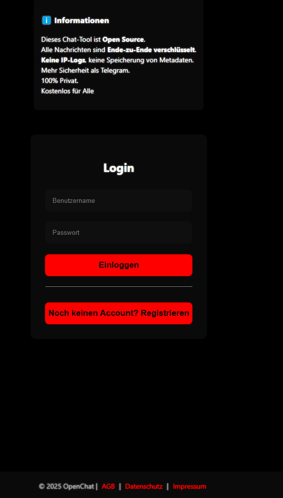
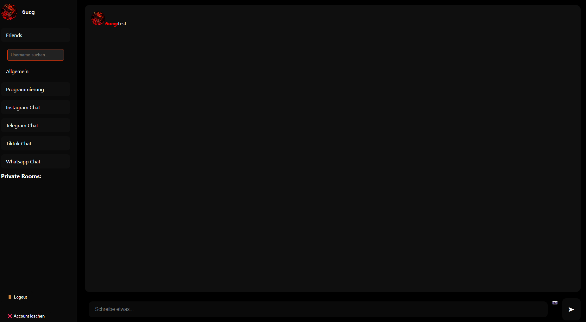

# 💬 OpenChat – Sichere, moderne Chat-App

Ein voll funktionsfähiges, webbasiertes Chat-System mit Benutzerkonten, Medienunterstützung und Ende-zu-Ende-Speicherung. Entwickelt mit **Node.js**, **Socket.io**, **Express**, und **Vanilla JS**.

## 🚀 Features

- 🔐 **Benutzerregistrierung und Login** mit Passwort-Hashing (bcrypt)
- 🧑‍💻 **Profilbearbeitung** inkl. Username, Passwort und Profilbild
- 🗨️ **Öffentliche und private Chat-Räume**
- 📎 **Medienunterstützung** (Bild, Video, mit Vorschau)
- 🔍 **User-Suche und private Chats**
- 🧠 **Nachrichtenspeicherung pro Raum (JSON)**
- 🟢 **Online-Status und Live-Nutzerliste**
- 📱 **Responsive Design**
- ❌ **Account-Löschung**

## 📁 Projektstruktur

```
📦 Projekt
├── server.js              # Node.js Backend + Socket.io
├── users.json             # Benutzer-Datenbank
├── /Databank/             # Gespeicherte Nachrichten pro Raum
├── /Website/              # Ui
```

## ⚙️ Installation

### Voraussetzungen

- Node.js (empfohlen: ≥ v16)
- npm

### Schritte

```bash
git clone https://github.com/7ucg/chat-app.git
cd chat-app
npm install
node server.js
```

Die App läuft standardmäßig unter [http://localhost:3000](http://localhost:3000)

## 🧪 Testzugang

Du kannst dich frei registrieren. Für Testzwecke können Dummy-Bilder (Base64 oder Datei-Upload) verwendet werden.

## 🔐 Sicherheit

- Passwörter werden sicher mit **bcrypt** gehasht.
- Keine IP-Logs, keine externen Tracker.
- Nachrichten werden lokal pro Raum gespeichert.
- Keine Metadatenanalyse.
- Ende-zu-Ende-Verschlüsselung wird derzeit **simuliert** (noch nicht implementiert).

## 📸 Medienunterstützung

- Akzeptiert: `PNG`, `JPG`, `MP4`
- Max. Dateigröße: **10 MB**
- Vorschau vor dem Senden
- Klickbare Medien (Fullscreen)

## 📈 Geplante Features

- 🔒 Echte Ende-zu-Ende-Verschlüsselung (mit WebCrypto)
- 📬 Push-Benachrichtigungen
- 🌐 Mehrsprachigkeit
- 🧑‍🤝‍🧑 Freundesverwaltung

## 🖼️ Screenshots

### Login-Seite



### Chat-Ansicht



## 👤 Autor

**Baron**  
Open Source Liebhaber & JS-Entwickler

## 📄 Lizenz

Dieses Projekt ist **frei nutzbar** (MIT Lizenz geplant – siehe `LICENSE` demnächst).

---

> "Mehr Privatsphäre als Telegram – kostenlos für alle."
